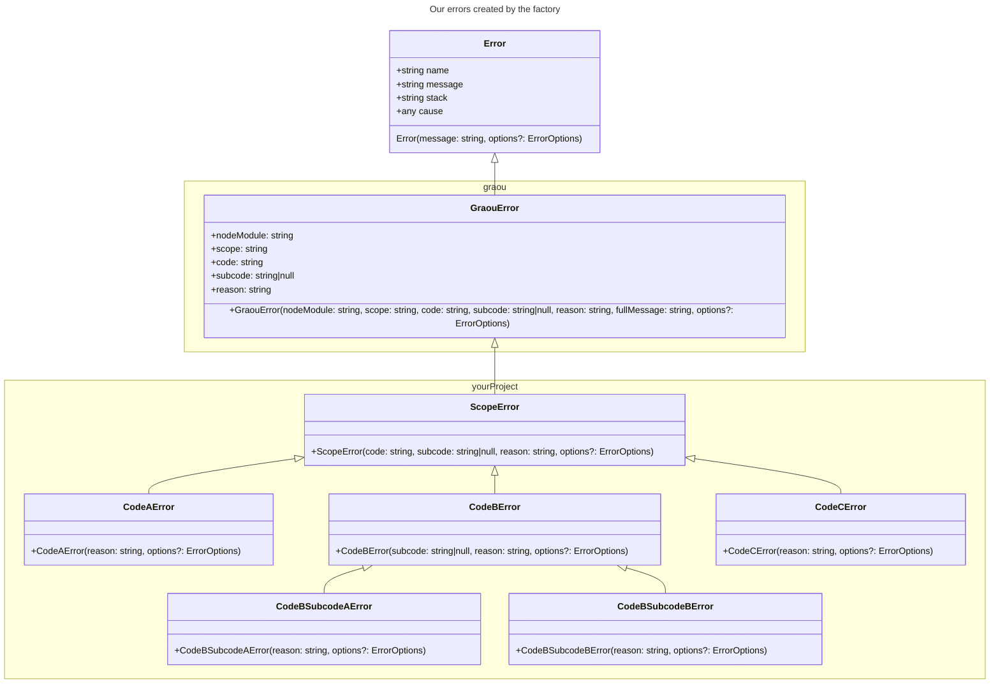

# Create errors

One of the first features of Graou is the error factory, which removes a lot of hassle from error management.
In a usual project, the good practice would be to create an error for each use case. If you're like me, you tend to create a single error and use it everywhere because it's boring to maintain.
Graou removes this issue by providing a factory for errors.

> [!NOTE]
> Check out the basic example: [TS](https://github.com/carthage-js/graou/blob/devel/examples/src/basic.ts)/[JS](https://github.com/carthage-js/graou/blob/devel/examples/src/basic.js)

## Step by step

The first step is to instantiate a factory for your package.
The key information is that errors are basically module-scoped.
An error factory instance mustn't be used or exported outside your library/app.
You will be able to customize some options for the errors.

```typescript
import graou from "@carthage-js/graou";

const errorsFactory = graou.makeModuleErrorsFactory({
  moduleName: "<YOUR PROJECT NAME>",
});
```

You can also provide a factory for the message held by the native error on `makeModuleErrorsFactory` with `messageFactory`.
The library provides a default pattern, but you can customize it if you need to.

```typescript
const errorsFactory = graou.makeModuleErrorsFactory({
  moduleName: "<YOUR PROJECT NAME>",
  messageFactory: (
    nodeModule: string,
    scope: string,
    code: string,
    subcode: string | null,
    reason: string,
  ) => "My custom message",
});
```

With this factory, you will be able to create errors for any case you need.
In the library design, you should create a bunch of errors by class or standalone functions.
To demonstrate this design, we are going to use this code:

```typescript
class MyToDoClient {
  private _baseUrl: string;

  constructor(baseUrl: string) {
    this._baseUrl = baseUrl;
  }

  async getVersion(): Promise<string> {
    const response = await fetch(`${this._baseUrl}/version`);
    const body = await response.json();
    return body.version;
  }

  async getToDoList(id: number): Promise<string> {
    const response = await fetch(`${this._baseUrl}/todo_list/${id}`);
    return await response.json();
  }
}
```

It's a simple REST API client, but this example doesn't handle errors.
So a 5xx or 4xx status code is not handled.
By design, we want to handle this kind of thing, so we add this code to the method:

```typescript
const response = await fetch(`${this._baseUrl}/...`);
if (response.status < 200 || response.status >= 300) {
  throw new Error("Something went wrong", { cause: response });
}
const body = await response.json();
return body.version;
```

It's actually nice because now we know when a request fails.
It's not really good practice to use the basic error directly.
The developer won't be able to distinguish errors in the `catch` if they are using the same type.
So let's go ahead and add a custom error class:

```typescript
class MyToDoClientError extends Error {
  constructor(message: string, options?: ErrorOptions) {
    super(message, options);
  }
}
```

We can now replace `new Error` with `new MyToDoClientError`.
So now, we can distinguish errors issued by the client from the rest of the code.
It's actually what libraries like Axios (HTTP client) do.
There is still an issue here. We can't distinguish which method was called here.
If we repeat what we did earlier, it's pretty easy to handle.

```typescript
class MyToDoClientError extends Error {
  constructor(message: string, options?: ErrorOptions) {
    super(message, options);
  }
}

class MyToDoClientGetVersionError extends MyToDoClientError {
  constructor(message: string, options?: ErrorOptions) {
    super(message, options);
  }
}

class MyToDoClientGetToDoListError extends MyToDoClientError {
  constructor(message: string, options?: ErrorOptions) {
    super(message, options);
  }
}
```

Then we will be able to throw the error where we need it.
It's starting to feel a bit redundant.
So we end up keeping a single error class because it's easier and quicker to handle.
Graou removes this hassle with the factory we created earlier.

```typescript
const MyToDoClientErrors = errorsFactory("MyToDoClient", ["GetVersion", "GetToDoList"]);
```

Now we can replace our `MyToDoClientError` by `MyToDoClientErrors.codes.<GetVersion|GetToDoList>.factory`.
Our file will look like this:

```typescript
const MyToDoClientErrors = errorsFactory("MyToDoClient", ["GetVersion", "GetToDoList"]);

class MyToDoClient {
  private _baseUrl: string;

  constructor(baseUrl: string) {
    this._baseUrl = baseUrl;
  }

  async getVersion(): Promise<string> {
    const response = await fetch(`${this._baseUrl}/version`);
    if (response.status < 200 || response.status >= 300) {
      throw new MyToDoClientErrors.codes.GetVersion.factory("Something went wrong", {
        cause: response,
      });
    }
    const body = await response.json();
    return body.version;
  }

  async getToDoList(id: number): Promise<string> {
    const response = await fetch(`${this._baseUrl}/todo_list/${id}`);
    if (response.status < 200 || response.status >= 300) {
      throw new MyToDoClientErrors.codes.GetToDoList.factory("Something went wrong", {
        cause: response,
      });
    }
    return await response.json();
  }
}
```

On usage, we can do things like this:

```typescript
const client = new MyToDoClient("https://my.todo.mock");
try {
  // ... things with my client
} catch (err) {
  if (err instanceof MyToDoClientErrors.codes.GetVersion.$class) {
    // It's GetVersion that throw an error
  } else if (err instanceof MyToDoClientErrors.scope.$class) {
    // It's a thing related to my client.
  }
}
```

> [!NOTE]
>   
> The reason parameter of the error factory become optional.

## Logging

Another good thing that comes with Graou errors.
They have a `toJson` method that helps either send data back to the client or print it in logs.
This is particularly useful when working with Datadog, Grafana, or other logging systems.

```typescript
import graou from "@carthage-js/graou";

try {
  // ... Critical code
} catch (err) {
  if (err instanceof graou.GraouError) {
    console.error(err.toJson());
  }
}
```

So the library will print this kind of JSON:

```json
{
  "nodeModule": "my_node_module",
  "scope": "MyToDoClient",
  "code": "GetVersion",
  "reason": "Something went wrong",
  "cause": "Raw error message"
}
```

The resulting JSON sums up the data given to the factory with the data given to the factory method.
The `cause` attribute is either the same structured JSON if it's a `GraouError`, or only the message if it's a basic `Error`.
The `cause` is not disclosed if it's something else, to avoid printing sensitive data.
You can also control how deep you want to stringify this error with the depth parameter of the method.
This way, it won't show the cause because it can't go any deeper.

## Subcodes

In some cases, you need to provide more details about a method because a single error may not be sufficient.
You can create subcodes for a code. In this case, the code becomes abstract, and the factory is no longer available for that code.
A subcode works like a regular code, but it directly inherits from the code class rather than from the scope class.

```typescript
const errors = errorsFactory("MyScope", ["SimpleCode", "CodeWithSubcode"], {
  CodeWithSubcode: ["CodeA", "CodeB"],
});
```

## Class relationship diagram


